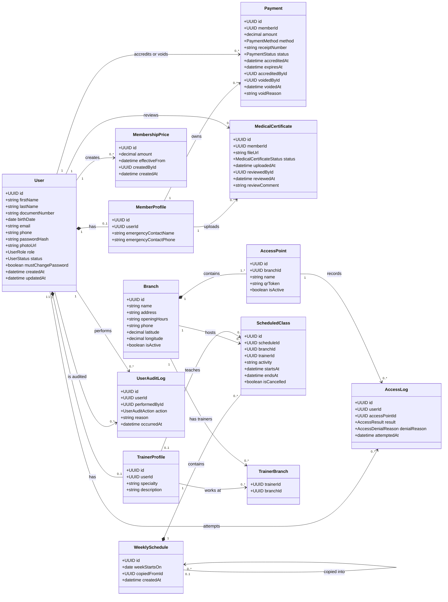
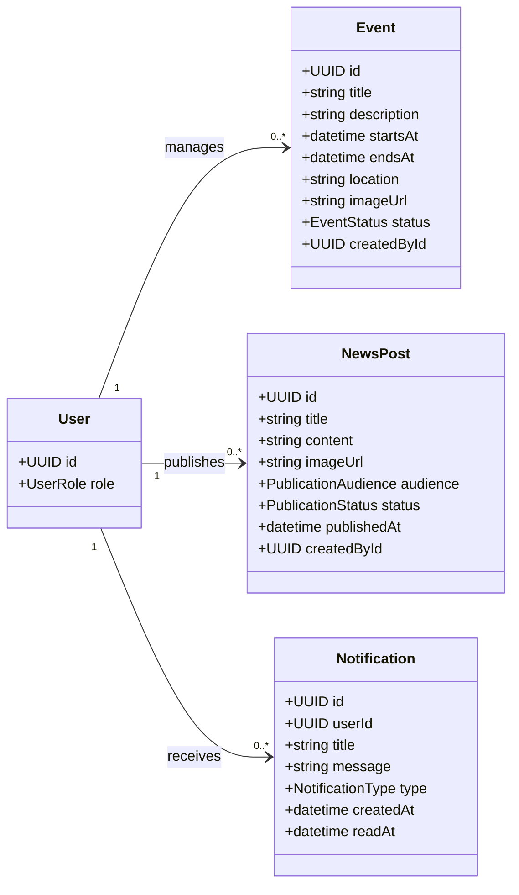

# Modelo de dominio de M-Team

Esta primera versión representa los conceptos del negocio definidos en el alcance. No incluye controladores, servicios, repositorios, JWT ni componentes de la interfaz.

## Núcleo operativo

## Comunicación y contenido

## Estados del dominio

```mermaid
classDiagram
class UserRole {
  <<enumeration>>
  MEMBER
  TRAINER
  ADMIN
}
class UserStatus {
  <<enumeration>>
  ACTIVE
  INACTIVE
}
class PaymentStatus {
  <<enumeration>>
  ACCREDITED
  VOIDED
}
class PaymentMethod {
  <<enumeration>>
  CASH
  BANK_TRANSFER
  DEBIT_CARD
  CREDIT_CARD
  OTHER
}
class MedicalCertificateStatus {
  <<enumeration>>
  PENDING
  APPROVED
  REJECTED
}
class AccessResult {
  <<enumeration>>
  ALLOWED
  DENIED
}
class AccessDenialReason {
  <<enumeration>>
  INACTIVE_USER
  INACTIVE_BRANCH
  INACTIVE_ACCESS_POINT
  EXPIRED_MEMBERSHIP
  MEDICAL_CERTIFICATE_REQUIRED
}
class UserAuditAction {
  <<enumeration>>
  CREATED
  UPDATED
  ACTIVATED
  DEACTIVATED
  PASSWORD_RESET
}
class EventStatus {
  <<enumeration>>
  DRAFT
  PUBLISHED
  CANCELLED
}
class PublicationAudience {
  <<enumeration>>
  ALL
  MEMBERS
  TRAINERS
}
class PublicationStatus {
  <<enumeration>>
  DRAFT
  PUBLISHED
  INACTIVE
}
class NotificationType {
  <<enumeration>>
  MEMBERSHIP_PRICE_CHANGED
  MEMBERSHIP_EXPIRING
  MEMBERSHIP_EXPIRED
  MEDICAL_CERTIFICATE_REVIEWED
  CLASS_CHANGED
  EVENT_CANCELLED
  GENERAL
}
```

## Reglas que no deben modelarse como datos duplicados

- El estado de la cuota se calcula en el backend a partir del último pago acreditado: `CURRENT`, `EXPIRING_SOON` o `EXPIRED`.
- `expiresAt` se fija en 30 días desde `accreditedAt`; un pago nuevo reemplaza la vigencia anterior y no acumula días.
- Durante los primeros 20 días desde el primer pago acreditado, un socio puede ingresar sin apto aprobado.
- Un entrenador no necesita cuota ni apto médico para ingresar, pero su cuenta debe estar activa.
- Desactivar entidades conserva sus relaciones e historial.
- Los estados `UPCOMING` y `FINISHED` de un evento se derivan de la fecha; `CANCELLED` sí se persiste.

## Decisiones pendientes de validación

1. Confirmar los medios de pago aceptados por M-Team.
2. Confirmar si una clase tiene duración explícita o solamente día y hora de inicio.
3. Definir si los eventos se vinculan opcionalmente con una sede además de admitir una ubicación libre.
4. Definir si debe conservarse cada versión de un apto rechazado; el modelo actual conserva todas las cargas.
5. Determinar si los administradores necesitan un perfil propio o si los datos de `User` son suficientes.

