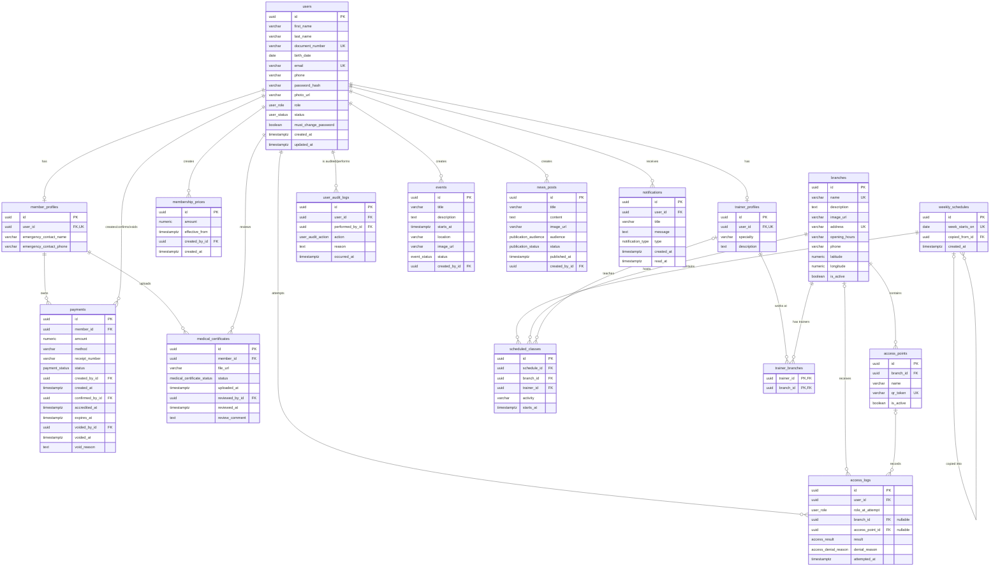

# Modelo relacional de M-Team

Este modelo deriva del [modelo de dominio](./modelo-de-dominio.md) y de la [matriz de trazabilidad](./matriz-de-trazabilidad.md). Utiliza nombres de tablas y columnas en `snake_case`, tablas en plural y claves foráneas con el sufijo `_id`.

## Diagrama entidad-relación

## Enumeraciones

| Enumeración | Valores |
|---|---|
| `user_role` | `MEMBER`, `TRAINER`, `ADMIN` |
| `user_status` | `ACTIVE`, `INACTIVE` |
| `payment_status` | `ACCREDITED`, `VOIDED` |
| `medical_certificate_status` | `PENDING`, `APPROVED`, `REJECTED` |
| `access_result` | `ALLOWED`, `DENIED` |
| `access_denial_reason` | `INVALID_QR`, `INACTIVE_USER`, `INACTIVE_BRANCH`, `INACTIVE_ACCESS_POINT`, `EXPIRED_MEMBERSHIP`, `MEDICAL_CERTIFICATE_REQUIRED` |
| `user_audit_action` | `CREATED`, `UPDATED`, `ACTIVATED`, `DEACTIVATED`, `PASSWORD_RESET` |
| `event_status` | `DRAFT`, `PUBLISHED`, `CANCELLED` |
| `publication_audience` | `ALL`, `MEMBERS`, `TRAINERS` |
| `publication_status` | `DRAFT`, `PUBLISHED`, `INACTIVE` |
| `notification_type` | `MEMBERSHIP_PRICE_CHANGED`, `MEMBERSHIP_EXPIRING`, `MEMBERSHIP_EXPIRED`, `MEDICAL_CERTIFICATE_REVIEWED`, `CLASS_CHANGED`, `EVENT_CANCELLED`, `GENERAL` |

El medio de pago permanece como `varchar` validado por la aplicación hasta que M-Team confirme los valores aceptados. Luego podrá convertirse en una enumeración sin modificar las relaciones.

## Restricciones principales

- `users.email` y `users.document_number` son únicos, comparando el correo normalizado en minúsculas.
- Cada usuario puede tener como máximo un perfil de socio o de entrenador, coherente con su rol.
- `membership_prices.amount` y `payments.amount` deben ser mayores que cero.
- `payments.expires_at` equivale a `accredited_at + 30 días` para pagos acreditados.
- Un pago anulado requiere `voided_by_id`, `voided_at` y `void_reason`.
- Un apto rechazado requiere `reviewed_by_id`, `reviewed_at` y `review_comment`.
- Un apto aprobado requiere responsable y fecha de revisión, pero no fecha de vencimiento.
- `branches.name`, `branches.address` y `access_points.qr_token` son únicos.
- `access_logs.denial_reason` es obligatorio solamente cuando `result = DENIED`.
- `access_logs.branch_id` y `access_logs.access_point_id` pueden ser nulos solamente cuando el QR es inexistente o fue alterado y el motivo es `INVALID_QR`.
- `weekly_schedules.week_starts_on` debe representar siempre el comienzo acordado de una semana y ser único.
- `trainer_branches` utiliza una clave primaria compuesta para evitar asignaciones duplicadas.
- Los registros históricos no se eliminan al desactivar usuarios, entrenadores, sedes o puntos de acceso.

## Índices recomendados

| Tabla | Índice |
|---|---|
| `users` | `(role, status)`, `last_name`, `first_name` |
| `membership_prices` | `effective_from DESC` |
| `payments` | `(member_id, accredited_at DESC)`, `(status, accredited_at)`, `receipt_number` |
| `medical_certificates` | `(member_id, uploaded_at DESC)`, `(status, uploaded_at)` |
| `access_logs` | `(user_id, attempted_at DESC)`, `(branch_id, attempted_at DESC)`, `(result, attempted_at)` |
| `scheduled_classes` | `(schedule_id, starts_at)`, `(trainer_id, starts_at)`, `(branch_id, starts_at)` |
| `events` | `(status, starts_at)` |
| `news_posts` | `(status, audience, published_at DESC)` |
| `notifications` | `(user_id, created_at DESC)`, `(user_id, read_at)` |

## Decisiones para la traducción a Prisma

- Las claves primarias se generarán con UUID.
- Todos los instantes se almacenarán como `timestamptz`; las fechas sin hora utilizarán `date`.
- Las relaciones con datos históricos usarán `ON DELETE RESTRICT` o `NO ACTION`.
- Los campos opcionales incluyen fotografías, comprobantes, revisiones aún no realizadas, anulaciones, coordenadas, entrenador de una clase y fecha de lectura.
- Los estados de cuota y de finalización de eventos no se almacenarán porque se calculan con la fecha actual.
